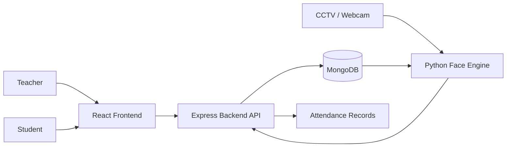

# CCTV Based Attendance System

A CCTV and face-recognition attendance system with a Node.js/Express backend, React frontend, MongoDB storage, and Python face-recognition services.

## Architecture Overview



The interactive architecture diagram is available at [architecture-runtime.html](architecture-runtime.html). The diagram source and visual-check files are stored beside it in the repository.

## Project Areas

- `frontend/` - React and Vite user interface for teachers and students.
- `backend/` - Express API, authentication, attendance, schedules, and MongoDB models.
- `face-engine/` - Face detection, recognition, tracking, camera streaming, and attendance processing.

## End-to-End Workflow

1. A teacher or student opens the React frontend.
2. The user registers or logs in through the Express API.
3. The backend validates the request, reads configuration from `.env`, connects to MongoDB, and returns an authentication token.
4. Student profile and face-embedding data are stored in MongoDB.
5. The CCTV or webcam sends frames to the Python face engine.
6. The face engine detects faces, evaluates face quality, creates embeddings, and matches them with stored student embeddings.
7. The attendance pipeline sends recognized identity and attendance data to the backend.
8. The backend validates and stores attendance records in MongoDB.
9. The teacher views attendance through the dashboard, while the student views their own attendance and profile.

## User Flows

### Teacher

`Landing page -> Teacher login -> Teacher dashboard -> Schedule or monitor live attendance -> Review attendance`

### Student

`Landing page -> Student registration -> Student login -> Student dashboard -> View attendance and profile`

### Attendance Recognition

`Camera frame -> Face detection -> Quality check -> Face embedding -> Identity matching -> Attendance API -> MongoDB -> Dashboard`

## Current Branch Work

The `s-project-development` branch is based on `project-development` and includes:

- Student registration, login, and dashboard pages.
- Student authentication routes and backend model support.
- Updated attendance and authentication services.
- Face-engine pipeline, camera-streaming, and API updates.
- Environment example files for backend and face-engine configuration.
- Runtime architecture documentation and visual-check artifacts.

For the complete file-level summary and merge checklist, see [S_PROJECT_DEVELOPMENT_CHANGES.md](S_PROJECT_DEVELOPMENT_CHANGES.md).

## Configuration

Create local `.env` files from the provided examples before running the services:

- `backend/.env.example`
- `face-engine/.env.example`

Keep passwords, tokens, database URLs, and other secrets out of Git.

The frontend uses `VITE_API_URL` for the backend API URL and defaults to `http://localhost:5000/api` during local development.

## Local Setup

### Prerequisites

- Node.js and npm
- Python 3 and a virtual environment
- MongoDB or a MongoDB Atlas connection
- A working webcam or CCTV stream for live recognition

### Start the Backend

```powershell
cd backend
npm install
npm run dev
```

The API listens on `http://localhost:5000` by default.

### Start the Frontend

```powershell
cd frontend
npm install
npm run dev
```

Open the Vite URL shown in the terminal. Set `VITE_API_URL` in `frontend/.env` when the backend is not running at the default URL.

### Start the Face Engine

```powershell
cd face-engine
python -m venv .venv
.\.venv\Scripts\Activate.ps1
pip install -r requirements.txt
python live_recognition.py
```

The face engine requires the values in `face-engine/.env.example` and access to the student embeddings in MongoDB. Hardware acceleration is optional; the recognition code can use the available CPU or CUDA device.

## Before Merging

Verify teacher login, student registration and login, attendance API requests, MongoDB connectivity, face-engine camera processing, frontend linting, and the production build before merging `s-project-development` into `project-development`.

## Useful Checks

```powershell
cd frontend
npm run lint
npm run build
```

For the file-by-file branch summary and merge checklist, see [S_PROJECT_DEVELOPMENT_CHANGES.md](S_PROJECT_DEVELOPMENT_CHANGES.md).
